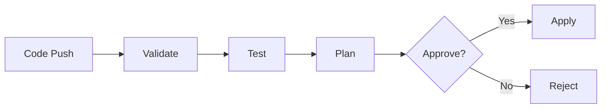

# CI/CD Workflows Guide

Complete guide to integrating Terraform/OpenTofu into continuous integration and deployment pipelines.

---

## Recommended Workflow Stages



### Stage Breakdown

| Stage | Actions | Tools | When |
|-------|---------|-------|------|
| **Validate** | Format, syntax, lint | `fmt`, `validate`, `tflint` | Every commit |
| **Test** | Unit tests, security scan | `terraform test`, `trivy`, `checkov` | Every PR |
| **Plan** | Generate execution plan | `terraform plan` | Every PR |
| **Apply** | Execute changes | `terraform apply` | Post-merge (auto or manual) |

---

## GitHub Actions Templates

### Basic Validation Workflow

```yaml
# .github/workflows/terraform-validate.yml
name: Terraform Validate

on:
  pull_request:
    paths:
      - '**.tf'
      - '**.tfvars'
      - '.github/workflows/terraform-*.yml'

permissions:
  contents: read
  pull-requests: write

jobs:
  validate:
    name: Validate
    runs-on: ubuntu-latest

    steps:
      - name: Checkout
        uses: actions/checkout@v4

      - name: Setup Terraform
        uses: hashicorp/setup-terraform@v3
        with:
          terraform_version: 1.9.0

      - name: Terraform Format Check
        run: terraform fmt -check -recursive

      - name: Terraform Init
        run: terraform init -backend=false

      - name: Terraform Validate
        run: terraform validate

      - name: Setup TFLint
        uses: terraform-linters/setup-tflint@v4
        with:
          tflint_version: latest

      - name: TFLint Init
        run: tflint --init

      - name: TFLint
        run: tflint --format compact
```

### Testing Workflow (with cost optimization)

```yaml
# .github/workflows/terraform-test.yml
name: Terraform Test

on:
  pull_request:
    paths:
      - '**.tf'
      - '**.tfvars'
      - 'tests/**'

permissions:
  contents: read
  pull-requests: write

jobs:
  unit-tests:
    name: Unit Tests (Mocked)
    runs-on: ubuntu-latest

    steps:
      - uses: actions/checkout@v4

      - uses: hashicorp/setup-terraform@v3
        with:
          terraform_version: "~> 1.7"  # Mocking requires 1.7+

      - name: Run Unit Tests (No Real Resources)
        run: terraform test -filter=tests/unit_*.tftest.hcl

  integration-tests:
    name: Integration Tests (Real Resources)
    runs-on: ubuntu-latest
    if: github.ref == 'refs/heads/main'  # Only on main branch

    steps:
      - uses: actions/checkout@v4

      - uses: hashicorp/setup-terraform@v3
        with:
          terraform_version: 1.9.0

      - name: Configure AWS Credentials
        uses: aws-actions/configure-aws-credentials@v4
        with:
          role-to-assume: ${{ secrets.AWS_ROLE_ARN }}
          aws-region: us-east-1

      - name: Run Integration Tests
        run: terraform test -filter=tests/integration_*.tftest.hcl

      - name: Cleanup (on failure)
        if: failure()
        run: terraform test -cleanup -filter=tests/integration_*.tftest.hcl
```

### Plan Workflow with PR Comments

```yaml
# .github/workflows/terraform-plan.yml
name: Terraform Plan

on:
  pull_request:
    paths:
      - '**.tf'
      - '**.tfvars'

permissions:
  contents: read
  pull-requests: write

jobs:
  plan:
    name: Plan
    runs-on: ubuntu-latest

    steps:
      - uses: actions/checkout@v4

      - uses: hashicorp/setup-terraform@v3
        with:
          terraform_version: 1.9.0

      - name: Configure AWS Credentials
        uses: aws-actions/configure-aws-credentials@v4
        with:
          role-to-assume: ${{ secrets.AWS_ROLE_ARN }}
          aws-region: us-east-1

      - name: Terraform Init
        run: terraform init

      - name: Terraform Plan
        id: plan
        run: |
          terraform plan -no-color -out=tfplan
          terraform show -no-color tfplan > plan.txt

      - name: Comment PR
        uses: actions/github-script@v7
        with:
          github-token: ${{ secrets.GITHUB_TOKEN }}
          script: |
            const fs = require('fs');
            const plan = fs.readFileSync('plan.txt', 'utf8');
            const output = `### Terraform Plan 📊

            <details>
            <summary>Show Plan</summary>

            \`\`\`terraform
            ${plan}
            \`\`\`

            </details>

            *Pusher: @${{ github.actor }}, Action: \`${{ github.event_name }}\`*`;

            github.rest.issues.createComment({
              issue_number: context.issue.number,
              owner: context.repo.owner,
              repo: context.repo.repo,
              body: output
            });
```

### Apply Workflow (Manual Approval)

```yaml
# .github/workflows/terraform-apply.yml
name: Terraform Apply

on:
  push:
    branches:
      - main
    paths:
      - '**.tf'
      - '**.tfvars'

permissions:
  contents: read
  id-token: write  # For OIDC

jobs:
  apply:
    name: Apply
    runs-on: ubuntu-latest
    environment: production  # Requires manual approval

    steps:
      - uses: actions/checkout@v4

      - uses: hashicorp/setup-terraform@v3
        with:
          terraform_version: 1.9.0

      - name: Configure AWS Credentials
        uses: aws-actions/configure-aws-credentials@v4
        with:
          role-to-assume: ${{ secrets.AWS_ROLE_ARN }}
          aws-region: us-east-1

      - name: Terraform Init
        run: terraform init

      - name: Terraform Apply
        run: terraform apply -auto-approve
```

### Security Scanning Workflow

```yaml
# .github/workflows/security-scan.yml
name: Security Scan

on:
  pull_request:
  schedule:
    - cron: '0 0 * * 0'  # Weekly

jobs:
  trivy:
    name: Trivy Scan
    runs-on: ubuntu-latest

    steps:
      - uses: actions/checkout@v4

      - name: Run Trivy
        uses: aquasecurity/trivy-action@master
        with:
          scan-type: 'config'
          scan-ref: '.'
          format: 'sarif'
          output: 'trivy-results.sarif'

      - name: Upload to Security Tab
        uses: github/codeql-action/upload-sarif@v3
        with:
          sarif_file: 'trivy-results.sarif'

  checkov:
    name: Checkov Scan
    runs-on: ubuntu-latest

    steps:
      - uses: actions/checkout@v4

      - name: Run Checkov
        uses: bridgecrewio/checkov-action@master
        with:
          directory: .
          framework: terraform
          output_format: sarif
          output_file_path: checkov-results.sarif

      - name: Upload to Security Tab
        uses: github/codeql-action/upload-sarif@v3
        with:
          sarif_file: checkov-results.sarif
```

---

## GitLab CI Templates

### Complete Pipeline

```yaml
# .gitlab-ci.yml
stages:
  - validate
  - test
  - plan
  - apply

variables:
  TF_VERSION: "1.9.0"
  TF_ROOT: ${CI_PROJECT_DIR}

.terraform:
  image: hashicorp/terraform:${TF_VERSION}
  cache:
    paths:
      - ${TF_ROOT}/.terraform

validate:
  extends: .terraform
  stage: validate
  script:
    - terraform fmt -check -recursive
    - terraform init -backend=false
    - terraform validate
  rules:
    - if: $CI_PIPELINE_SOURCE == "merge_request_event"
    - if: $CI_COMMIT_BRANCH == $CI_DEFAULT_BRANCH

lint:
  image: ghcr.io/terraform-linters/tflint:latest
  stage: validate
  script:
    - tflint --init
    - tflint --format compact
  rules:
    - if: $CI_PIPELINE_SOURCE == "merge_request_event"

test:
  extends: .terraform
  stage: test
  script:
    - terraform init
    - terraform test
  rules:
    - if: $CI_PIPELINE_SOURCE == "merge_request_event"

security:
  image: aquasec/trivy:latest
  stage: test
  script:
    - trivy config --severity HIGH,CRITICAL .
  rules:
    - if: $CI_PIPELINE_SOURCE == "merge_request_event"

plan:
  extends: .terraform
  stage: plan
  script:
    - terraform init
    - terraform plan -out=tfplan
    - terraform show -no-color tfplan > plan.txt
  artifacts:
    paths:
      - tfplan
      - plan.txt
    expire_in: 1 week
  rules:
    - if: $CI_PIPELINE_SOURCE == "merge_request_event"

apply:
  extends: .terraform
  stage: apply
  script:
    - terraform init
    - terraform apply -auto-approve
  dependencies:
    - plan
  rules:
    - if: $CI_COMMIT_BRANCH == $CI_DEFAULT_BRANCH
      when: manual
  environment:
    name: production
```

---

## Atlantis Integration

### atlantis.yaml

```yaml
version: 3

projects:
  - name: production
    dir: environments/prod
    workspace: default
    terraform_version: v1.9.0
    autoplan:
      when_modified:
        - "**.tf"
        - "**.tfvars"
      enabled: true
    apply_requirements:
      - approved
      - mergeable

  - name: staging
    dir: environments/staging
    workspace: default
    terraform_version: v1.9.0
    autoplan:
      when_modified:
        - "**.tf"
        - "**.tfvars"
      enabled: true
    apply_requirements:
      - mergeable

workflows:
  default:
    plan:
      steps:
        - init
        - plan
    apply:
      steps:
        - apply

  custom:
    plan:
      steps:
        - run: terraform fmt -check
        - init
        - run: tflint
        - plan
    apply:
      steps:
        - run: terraform fmt -check
        - apply
```

### Atlantis Commands

```bash
# Comment on PR to trigger
atlantis plan -d environments/prod
atlantis apply -d environments/prod

# Auto-plan on PR
# (Atlantis detects .tf changes and runs plan automatically)
```

---

## Cost Optimization Strategies

### 1. Use Mock Providers for PR Validation

```hcl
# tests/unit_s3.tftest.hcl
mock_provider "aws" {}

run "validate_bucket_config" {
  command = plan  # No real resources created

  assert {
    condition     = aws_s3_bucket.this.bucket == var.bucket_name
    error_message = "Bucket name mismatch"
  }
}
```

**Savings:** $0 per test run

### 2. Run Integration Tests Only on Main Branch

```yaml
# GitHub Actions
integration-tests:
  if: github.ref == 'refs/heads/main'
  # ...
```

**Savings:** ~70% reduction (if 70% of commits are in feature branches)

### 3. Implement Auto-Cleanup

```yaml
- name: Cleanup Test Resources
  if: always()
  run: |
    terraform destroy -auto-approve
```

**Savings:** Prevents orphaned resources ($$$)

### 4. Tag Test Resources

```hcl
locals {
  test_tags = {
    Environment = "test"
    ManagedBy   = "Terraform"
    CIRun       = var.ci_run_id
    AutoDelete  = "true"
  }
}

resource "aws_instance" "test" {
  # ...
  tags = local.test_tags
}
```

**Benefit:** Easy identification and manual cleanup if needed

### 5. Use Scheduled Cleanup Jobs

```yaml
# .github/workflows/cleanup-test-resources.yml
name: Cleanup Test Resources

on:
  schedule:
    - cron: '0 2 * * *'  # Daily at 2 AM

jobs:
  cleanup:
    runs-on: ubuntu-latest
    steps:
      - name: Cleanup Resources Tagged AutoDelete
        run: |
          aws resourcegroupstaggingapi get-resources \
            --tag-filters Key=AutoDelete,Values=true \
            --query 'ResourceTagMappingList[*].ResourceARN' \
            --output text | \
          xargs -I {} aws resourcegroupstaggingapi delete-resources --resource-arn-list {}
```

### Cost Tracking

```bash
# Tag all test resources with cost allocation tags
aws ce get-cost-and-usage \
  --time-period Start=2024-01-01,End=2024-01-31 \
  --granularity MONTHLY \
  --metrics BlendedCost \
  --group-by Type=TAG,Key=Environment
```

---

## State Management in CI/CD

### Remote State Backend

```hcl
# backend.tf
terraform {
  backend "s3" {
    bucket         = "my-terraform-state"
    key            = "environments/prod/terraform.tfstate"
    region         = "us-east-1"
    encrypt        = true
    dynamodb_table = "terraform-locks"
  }
}
```

### State Locking

**DynamoDB table for locking:**
```hcl
resource "aws_dynamodb_table" "terraform_locks" {
  name         = "terraform-locks"
  billing_mode = "PAY_PER_REQUEST"
  hash_key     = "LockID"

  attribute {
    name = "LockID"
    type = "S"
  }
}
```

### Environment Separation

```
terraform-state/
├── prod/
│   └── terraform.tfstate
├── staging/
│   └── terraform.tfstate
└── dev/
    └── terraform.tfstate
```

---

## Secrets Management

### AWS Secrets Manager

```hcl
data "aws_secretsmanager_secret_version" "db_password" {
  secret_id = "prod/database/password"
}

resource "aws_db_instance" "this" {
  # ...
  password = data.aws_secretsmanager_secret_version.db_password.secret_string
}
```

### GitHub Secrets in Actions

```yaml
- name: Configure AWS Credentials
  uses: aws-actions/configure-aws-credentials@v4
  with:
    role-to-assume: ${{ secrets.AWS_ROLE_ARN }}
    aws-region: ${{ secrets.AWS_REGION }}
```

### Environment Variables

```yaml
env:
  TF_VAR_db_password: ${{ secrets.DB_PASSWORD }}
  TF_VAR_api_key: ${{ secrets.API_KEY }}
```

---

## Drift Detection

### Scheduled Drift Check

```yaml
# .github/workflows/drift-detection.yml
name: Drift Detection

on:
  schedule:
    - cron: '0 8 * * 1'  # Every Monday at 8 AM

jobs:
  detect-drift:
    runs-on: ubuntu-latest

    steps:
      - uses: actions/checkout@v4

      - uses: hashicorp/setup-terraform@v3

      - name: Configure AWS Credentials
        uses: aws-actions/configure-aws-credentials@v4
        with:
          role-to-assume: ${{ secrets.AWS_ROLE_ARN }}
          aws-region: us-east-1

      - name: Terraform Init
        run: terraform init

      - name: Terraform Plan (Check for Drift)
        id: plan
        run: terraform plan -detailed-exitcode
        continue-on-error: true

      - name: Notify on Drift
        if: steps.plan.outputs.exitcode == 2
        uses: slackapi/slack-github-action@v1
        with:
          webhook-url: ${{ secrets.SLACK_WEBHOOK }}
          payload: |
            {
              "text": "⚠️ Infrastructure drift detected in production!"
            }
```

---

## Best Practices Summary

### ✅ DO

- **Validate on every commit** (fmt, validate, lint)
- **Test with mocks on PRs** (fast, free)
- **Run integration tests on main branch only** (cost control)
- **Require manual approval for production applies**
- **Tag all test resources** (cost tracking)
- **Implement auto-cleanup** (prevent orphaned resources)
- **Use remote state with locking** (prevent conflicts)
- **Separate state by environment** (blast radius control)
- **Monitor for drift** (scheduled checks)
- **Use OIDC for cloud credentials** (no static keys)

### ❌ DON'T

- **Don't run integration tests on every commit** (expensive)
- **Don't auto-apply to production** (dangerous)
- **Don't commit secrets** (use secret managers)
- **Don't share state files between environments** (risky)
- **Don't skip state locking** (causes corruption)
- **Don't leave test resources running** (costly)

---

## Troubleshooting CI/CD Issues

### Issue: State Lock Errors

**Symptom:**
```
Error: Error acquiring the state lock
```

**Solution:**
```bash
# Force unlock (use with caution)
terraform force-unlock <LOCK_ID>

# Or wait for previous job to complete
```

### Issue: Plan Shows Changes on Every Run

**Symptom:** Terraform always shows changes even when nothing modified

**Causes:**
- Computed values changing
- Time-based values (timestamps)
- Random values without `keepers`

**Solution:**
```hcl
resource "random_id" "suffix" {
  byte_length = 4

  keepers = {
    # Change keepers only when you want new random value
    name = var.bucket_name
  }
}
```

### Issue: Test Resources Not Cleaned Up

**Solution: Use lifecycle hooks**
```yaml
- name: Cleanup
  if: always()
  run: terraform destroy -auto-approve
```

---

## Further Reading

- [GitHub Actions for Terraform](https://developer.hashicorp.com/terraform/tutorials/automation/github-actions)
- [GitLab CI/CD with Terraform](https://docs.gitlab.com/ee/user/infrastructure/iac/)
- [Atlantis Documentation](https://www.runatlantis.io/)
- [Terraform Cloud](https://developer.hashicorp.com/terraform/cloud-docs)
